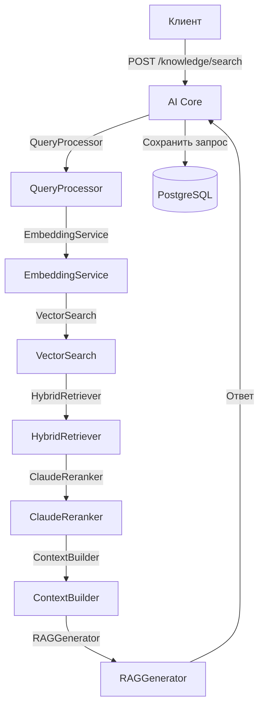

# План реализации RAG v2 и обновления ai-core/main.py

## Текущее состояние
- В директории `ai-core/rag/` присутствуют только `__init__.py` и `pipeline.py` (старый RAG v1).
- Компоненты RAG v2 (14 файлов) отсутствуют.
- Миграция БД `003_rag_v2` не создана (отсутствует в `backend/alembic/versions/`).
- В `backend/app/models/models.py` отсутствуют таблицы для RAG (knowledge_sources, knowledge_chunks, rag_queries, rag_feedback).

## Задачи

### 1. Создание недостающих компонентов RAG v2
Создать следующие файлы с минимальной реализацией (заглушки) для обеспечения импорта:

#### Конфигурация
- `ai-core/rag/config.py` — класс `RAGConfig` с настройками (pydantic-settings).
- `ai-core/rag/models.py` — Pydantic модели для запросов/ответов:
  - `KnowledgeSearchRequest`, `KnowledgeSearchResponse`
  - `KnowledgeAskRequest`, `KnowledgeAskResponse`
  - `SourceCreateRequest`, `SourceResponse`
  - `FeedbackRequest`
  - и другие.

#### Ingestion
- `ai-core/rag/ingestion/parser.py` — парсеры для Law, CourtPractice, Plenum, Template, FAQ.
- `ai-core/rag/ingestion/chunker.py` — `LegalChunker` (token-aware).
- `ai-core/rag/ingestion/embedder.py` — `EmbeddingService` (OpenAI batch).
- `ai-core/rag/ingestion/indexer.py` — `KnowledgeIndexer` (pgvector + FTS).
- `ai-core/rag/ingestion/pipeline.py` — `IngestionPipeline` (оркестратор).

#### Retrieval
- `ai-core/rag/retrieval/query_processor.py` — `QueryProcessor` (NER, classification, synonyms, case context).
- `ai-core/rag/retrieval/vector_search.py` — `VectorSearch` (pgvector cosine similarity).
- `ai-core/rag/retrieval/fts_search.py` — `FTSSearch` (PostgreSQL FTS, русский).
- `ai-core/rag/retrieval/hybrid.py` — `HybridRetriever` (RRF fusion).
- `ai-core/rag/retrieval/reranker.py` — `ClaudeReranker`.

#### Generation
- `ai-core/rag/generation/context_builder.py` — `ContextBuilder`.
- `ai-core/rag/generation/generator.py` — `RAGGenerator` (два промпта: юрист/клиент).

#### Evaluation
- `ai-core/rag/evaluation/metrics.py` — метрики оценки (пока пусто).

### 2. Создание миграции БД 003_rag_v2
Добавить таблицы:
- `knowledge_sources`
- `knowledge_chunks`
- `rag_queries`
- `rag_feedback`

Миграция должна быть создана в `backend/alembic/versions/003_rag_v2.py`.

### 3. Настройка подключения к БД в ai-core
Добавить в `ai-core/main.py`:
- Импорт `sqlalchemy.ext.asyncio`.
- Создание async engine и sessionmaker.
- Dependency `get_db`.
- Инициализацию RAG-компонентов (как синглтоны или фабрики).

### 4. Добавление 8 новых эндпоинтов
В `ai-core/main.py` добавить следующие эндпоинты:

| Метод | Путь | Описание |
|-------|------|----------|
| POST | `/knowledge/search` | Гибридный поиск по базе знаний |
| POST | `/knowledge/ask` | Вопрос-ответ с генерацией (RAG) |
| GET | `/knowledge/sources` | Список источников знаний |
| POST | `/knowledge/sources` | Добавить источник |
| POST | `/knowledge/sources/{source_id}/ingest` | Запустить ingestion |
| DELETE | `/knowledge/sources/{source_id}` | Удалить источник |
| POST | `/knowledge/feedback` | Обратная связь по результату |
| GET | `/knowledge/stats` | Статистика RAG |

Каждый эндпоинт должен использовать соответствующие Pydantic модели и вызывать соответствующие сервисы.

### 5. Сохранение обратной совместимости
Существующие эндпоинты `/rag/search`, `/rag/answer`, `/rag/index-seed` должны остаться без изменений (они используют старый RAG v1).

## Последовательность выполнения
1. Создать модели Pydantic (`models.py`) и конфиг (`config.py`).
2. Создать заглушки для всех компонентов (классы с методами, возвращающие mock-данные).
3. Создать миграцию БД.
4. Обновить `ai-core/main.py` с настройкой БД и эндпоинтами (пока с заглушками).
5. Протестировать, что эндпоинты возвращают корректные ответы.
6. Постепенно реализовать каждый компонент, заменяя заглушки на реальную логику.

## Диаграмма взаимодействия (Mermaid)

## Требования к коду
- Python 3.12, type hints.
- Async/await везде.
- Логирование через `logging.getLogger(__name__)`.
- Обработка ошибок (try/except → HTTPException).
- Замер времени выполнения.

## Следующие шаги
1. Утвердить план.
2. Переключиться в режим **Code** для реализации.
3. Использовать todo-лист для отслеживания прогресса.

---
*Документ создан: 2026-03-29 (UTC+5)*