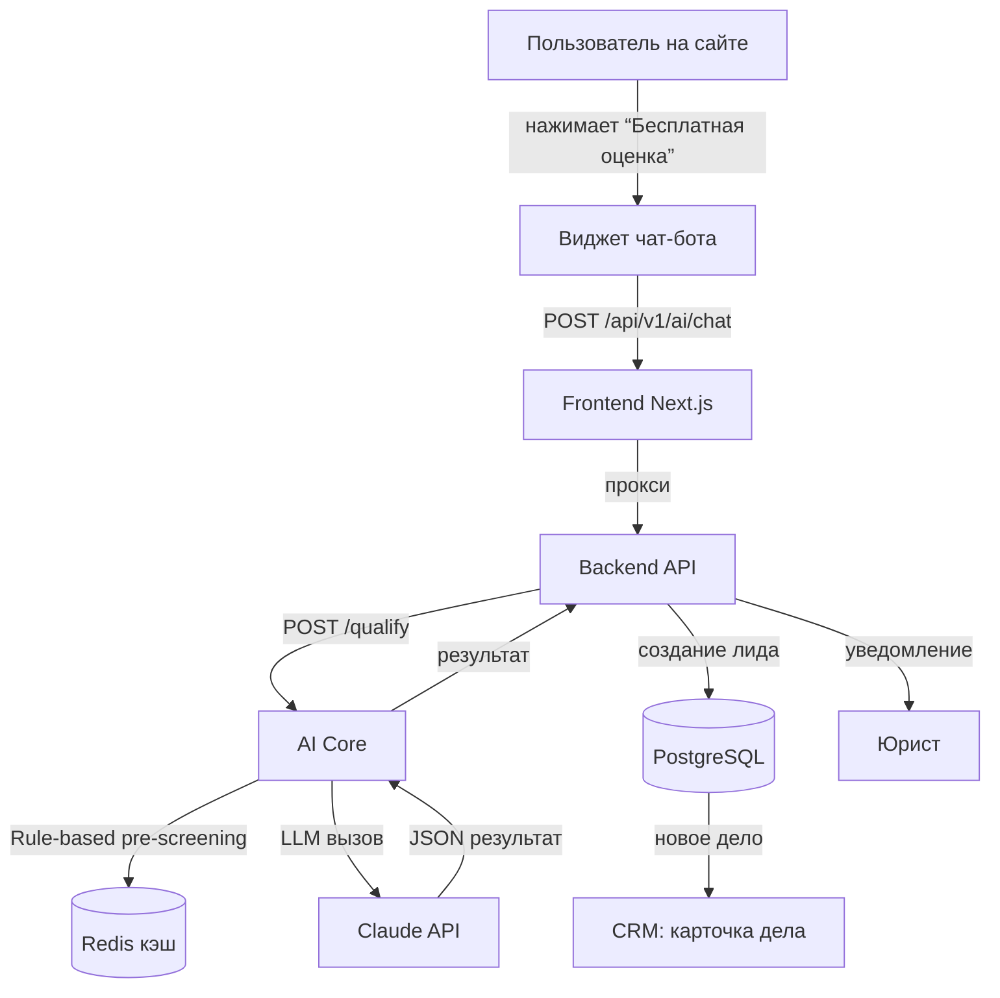

# Sprint 2: AI-квалификация — Детальный план

**Сроки:** 2-3 недели (как запланировано в SPRINT_PLAN.md)

**Цель:** Завершить AI-квалификацию, интегрировать чат-бота на лендинг, автоматизировать создание лидов, улучшить надёжность и мониторинг.

## Текущее состояние

✅ **Инфраструктура (Sprint 0)** готова: Docker Compose поднимает 8 сервисов.

✅ **CRM-ядро (Sprint 1)** в основном завершено: CRUD дел, клиентов, кредиторов, стейт-машина, аудит.

✅ **AI Core** уже содержит:
- Агент квалификации с rule-based pre-screening и LLM-скорингом (Claude API).
- Чат-бот для пошагового сбора данных.
- Заглушки для OCR, генерации документов, RAG (не реализованы).
- Интеграция с бэкендом через HTTP (`/qualify`, `/chat`).
- Таблица `ai_tasks` для логирования.

✅ **Frontend**:
- Лендинг (`/(site)/page.tsx`) с hero, преимуществами, шагами, CTA.
- Компонент `QualificationChatbot` (виджет с плавающей кнопкой).
- Страницы FAQ, контакты, блог.

✅ **Backend**:
- Эндпоинты `/ai/qualify`, `/ai/chat` (прокси к AI Core).
- Модель `AITask` для логирования.

## Задачи Sprint 2

### 1. Frontend — Лендинг и виджет

| Задача | Описание | Приоритет |
|--------|----------|-----------|
| **F‑1** | Интеграция виджета чат-бота на главную страницу | Высокий |
| **F‑2** | Добавить UTM-трекинг в формы (сохранение `utm_*` в localStorage и передача в бэкенд) | Средний |
| **F‑3** | Мобильная адаптация лендинга и виджета (проверить на экранах < 640px) | Высокий |
| **F‑4** | Кнопка «Бесплатная оценка» должна открывать чат-бот с начальным приветствием | Средний |
| **F‑5** | Страница результатов квалификации (после завершения чата) с кнопкой записи на консультацию | Средний |
| **F‑6** | Добавить аналитику (Google Tag Manager / Yandex.Metrika) для событий чата | Низкий |

### 2. Backend — Интеграция и кэширование

| Задача | Описание | Приоритет |
|--------|----------|-----------|
| **B‑1** | Эндпоинт создания лида из чат-бота (`POST /ai/lead`) | Высокий |
| **B‑2** | Автоматическое создание `Client` и `Case` со статусом `lead` при `action=qualify` | Высокий |
| **B‑3** | Redis-кэш для результатов квалификации (ключ: hash входных данных, TTL 24h) | Высокий |
| **B‑4** | Rate limiting на `/ai/qualify` (100 запросов/час на IP) | Средний |
| **B‑5** | Валидация входных данных (pydantic с кастомными правилами) | Средний |
| **B‑6** | Webhook для записи на консультацию (интеграция с Calendly или простая форма уведомления) | Средний |
| **B‑7** | Обновление поля `ai_score` в модели `Case` после квалификации | Высокий |

### 3. AI Core — Улучшения и надёжность

| Задача | Описание | Приоритет |
|--------|----------|-----------|
| **A‑1** | Кэширование результатов pre-screening в Redis (избегать лишних вызовов LLM) | Высокий |
| **A‑2** | Обработка ошибок Claude API (retry, fallback на OpenAI) | Высокий |
| **A‑3** | Логирование AI-задач с метриками (cost, tokens, duration) в `ai_tasks` | Высокий |
| **A‑4** | Разделение агентов на подмодули (`agents/qualification`, `agents/ocr`, `agents/document`) | Средний |
| **A‑5** | Улучшение промптов (вынести в конфигурационные файлы `prompts/`) | Низкий |
| **A‑6** | Добавление health-check эндпоинта с проверкой подключения к внешним API | Средний |
| **A‑7** | Мониторинг: подключение Sentry для ошибок, метрики Prometheus (количество запросов, latency) | Средний |

### 4. Тестирование

| Задача | Описание | Приоритет |
|--------|----------|-----------|
| **T‑1** | Unit-тесты для агента квалификации (mock LLM) | Высокий |
| **T‑2** | Интеграционные тесты для эндпоинтов `/ai/qualify` и `/ai/chat` | Высокий |
| **T‑3** | E2E-тест сквозного сценария: пользователь заходит на сайт → общается с ботом → создаётся лид в CRM | Средний |
| **T‑4** | Нагрузочное тестирование (Locust) для проверки rate limiting и кэширования | Низкий |

### 5. Архитектурные улучшения

| Задача | Описание | Приоритет |
|--------|----------|-----------|
| **AR‑1** | Асинхронная обработка тяжёлых задач (OCR, генерация документов) через очередь Redis (доработать worker) | Средний |
| **AR‑2** | Модульность AI Core: каждый агент со своим роутером (`/qualify`, `/ocr`, `/generate-document`) | Средний |
| **AR‑3** | Безопасность: обязать использование переменных окружения в продакшене, добавить валидацию `SECRET_KEY` | Высокий |
| **AR‑4** | Конфигурация через `pydantic-settings` (единый источник для всех сервисов) | Низкий |

## Диаграмма взаимодействия (Mermaid)

## Оценка времени и команда

**Оценка времени:** 2-3 недели (соответствует плану спринта).

**Команда:**
- Frontend-разработчик (Next.js) — задачи F‑1…F‑6.
- Backend-разработчик (Python) — задачи B‑1…B‑7, AR‑1…AR‑4.
- AI-инженер — задачи A‑1…A‑7.
- QA-инженер (частично) — задачи T‑1…T‑4.

## Критерии завершения (Definition of Done)

1. **Пользовательский сценарий работает от начала до конца:**
   - Заходит на сайт `bankruptcy.ai`.
   - Нажимает «Бесплатная оценка за 2 минуты».
   - Чат-бот задаёт вопросы по одному.
   - После сбора данных получает предварительную оценку (стоимость, сроки, рекомендация).
   - Система автоматически создаёт лид в CRM (клиент + дело со статусом `lead`).
   - Юрист видит новое дело в панели CRM.

2. **Надёжность:**
   - Кэширование снижает нагрузку на LLM на 50% для идентичных запросов.
   - При недоступности Claude API система переключается на OpenAI или возвращает rule-based оценку.
   - Rate limiting защищает от злоупотреблений.

3. **Мониторинг:**
   - Все вызовы AI Core записываются в `ai_tasks` с метриками (cost, tokens, duration).
   - Ошибки логируются в Sentry.
   - Health-check эндпоинты отвечают 200.

## Следующие шаги

1. **Утвердить план** (текущий шаг).
2. **Переключиться в режим Code** для реализации конкретных задач.
3. **Использовать todo-листы** для трекинга прогресса.
4. **Провести демонстрацию** по завершении спринта: полный поток от сайта до лида в CRM.

---
*Документ создан: 2026-03-25 (UTC+5)*